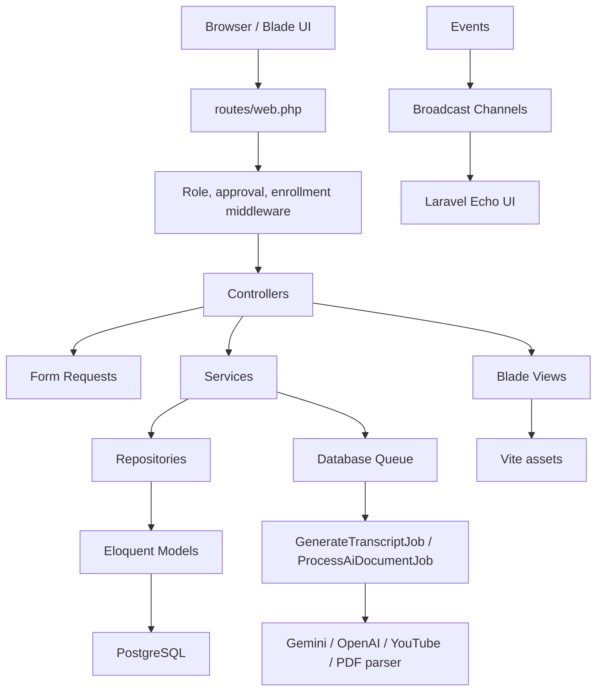

# StackLearn Architecture

This document describes the current architecture of StackLearn based on the repository code.

## System Summary

StackLearn is a Laravel 12 LMS with a Blade-based web UI, Vite assets, role-based portals, ecommerce checkout, course learning workflows, AI tutor, transcript indexing, moderation, payout, and realtime chat/discussion features.

Primary roles:

- `admin`: platform operations, approvals, users, finance, settings, analytics, moderation.
- `instructor`: course creation, lecture upload, quiz authoring, discussion management, revenue and payout requests.
- `user`: course discovery, purchase, learning, quiz attempts, notes, discussions, AI tutor, refunds.

## Technology Stack

- Backend: Laravel Framework `^12.0`, PHP `^8.2`
- Auth: Laravel Breeze, email verification, Socialite Google/Facebook login
- Frontend: Blade, Tailwind CSS, Alpine.js, Vite
- Database: PostgreSQL by default in `.env.example`
- Queue: database queue driver by default
- Realtime: Laravel Reverb dependency, Laravel Echo, Pusher JS
- Payments: Stripe PHP SDK and VNPay repository implementation
- Storage: local disk plus S3/R2 style configuration for lecture assets
- AI: Gemini services, OpenAI transcription service, YouTube transcript extraction, PDF parser, document chunking/retrieval

## High-Level Runtime



## Request Flow

1. A route in `routes/web.php` receives the request.
2. Middleware in `bootstrap/app.php` enforces role, instructor approval, or course enrollment where needed.
3. A controller in `app/Http/Controllers` coordinates the request.
4. A Form Request in `app/Http/Requests` validates user input when the module has one.
5. Business logic is delegated to a service in `app/Services`.
6. Data access is delegated to a repository in `app/Repositories` when that pattern exists for the module.
7. Eloquent models in `app/Models` persist data and expose relationships.
8. The response is usually a Blade view, redirect, or JSON response for AJAX endpoints.

## Route Organization

Main file: `routes/web.php`.

- Admin portal:
  - Prefix: `/admin`
  - Route name prefix: `admin.`
  - Middleware: `auth`, `verified`, `role:admin`

- Instructor portal:
  - Prefix: `/instructor`
  - Route name prefix: `instructor.`
  - Middleware: `auth`, `verified`, `role:instructor`, `instructor.approved`

- User dashboard:
  - Prefix: `/user`
  - Route name prefix: `user.`
  - Middleware: `auth`, `verified`, `role:user`

- Learning player:
  - Middleware: `auth`, `course.enrollment`
  - Routes: `/khoa-hoc/{slug}/hoc`, `/khoa-hoc/{slug}/bai-hoc/{lecture_id}`

- Public frontend:
  - Home, course listing, course detail, instructor profile, cart, checkout.

Auth routes are loaded from `routes/auth.php`.

Broadcast authorization is in `routes/channels.php`.

## Middleware

Middleware aliases are configured in `bootstrap/app.php`:

- `role`: `App\Http\Middleware\RoleMiddleware`
- `instructor.approved`: `App\Http\Middleware\EnsureInstructorApproved`
- `course.enrollment`: `App\Http\Middleware\EnsureCourseEnrollment`

The code relies on middleware for portal access and learning access. Do not bypass these checks in controllers or views.

## Backend Layers

### Controllers

Controllers are grouped by audience:

- `app/Http/Controllers/backend`: admin, instructor, user dashboard, settings, course management, quizzes, lectures, chat.
- `app/Http/Controllers/frontend`: public pages, checkout, orders, learning, notes, discussions, reviews, wishlist, chatbot.
- `app/Http/Controllers/Auth`: Breeze auth flow.

### Services

Services hold most business workflows:

- Course and lecture: `CourseService`, `LectureService`, `CourseQualityChecklistService`
- Learning: `EnrollmentService`, `LearningProgressService`
- Commerce: `PaymentService`, `OrderService`, `RefundService`, `PayoutService`
- AI: `GeminiChatService`, `AiChatOrchestratorService`, `AiDocumentIndexService`, `TranscriptOrchestratorService`
- Governance: `ModerationService`, `GovernanceQueueService`, `InstructorRiskScoreService`, `AdminAuditLogService`

### Repositories

Repositories wrap repeated query/data access logic. When adding a feature to an existing module, prefer extending the matching repository instead of embedding complex queries in a controller.

## Frontend Architecture

The UI is Blade-first.

- Vite entry points:
  - `resources/css/app.css`
  - `resources/js/app.js`

- Tailwind content scan:
  - `resources/views/**/*.blade.php`
  - pagination vendor views
  - compiled view cache

View groups:

- Public: `resources/views/frontend`
- Admin: `resources/views/backend/admin`
- Instructor: `resources/views/backend/instructor`
- User: `resources/views/backend/user`
- Shared backend partials: `resources/views/backend/section`
- Laravel Breeze layouts/components: `resources/views/layouts`, `resources/views/components`

AJAX endpoints are used for cart, wishlist, learning progress, notes, discussions, AI tutor, and chat.

## Async Work

Queue default is `database`. Queue tables are present in the base Laravel migration.

Jobs:

- `app/Jobs/GenerateTranscriptJob.php`: background transcript generation.
- `app/Jobs/ProcessAiDocumentJob.php`: background document extraction, chunking, embedding/indexing.

Long-running AI/transcript/document operations should go through queue-backed workflows where practical.

## Realtime Architecture

Broadcast channels:

- `lecture.{lectureId}`: access depends on the current user's course access.
- `conversation.{conversationId}`: access is limited to the student or instructor in that conversation.

Events:

- `DiscussionCreated`
- `MessageSent`

Frontend Echo setup exists in `resources/js/echo.js`.

## Important Integration Boundaries

- Payment providers must be called through payment services/repositories.
- Enrollment should be granted only after a successful or explicitly authorized order/payment/admin action.
- AI keys/settings should come from `.env`, DB settings, or config services, not hard-coded values.
- Upload and presigned URL logic should stay inside lecture/file services.
- Admin actions that change platform state should keep audit logging where the current module already does so.

## Local Commands

```bash
composer install
npm install
php artisan key:generate
php artisan migrate --seed
composer run dev
```

Verification:

```bash
composer test
npm run build
vendor/bin/pint
php artisan route:list
```

