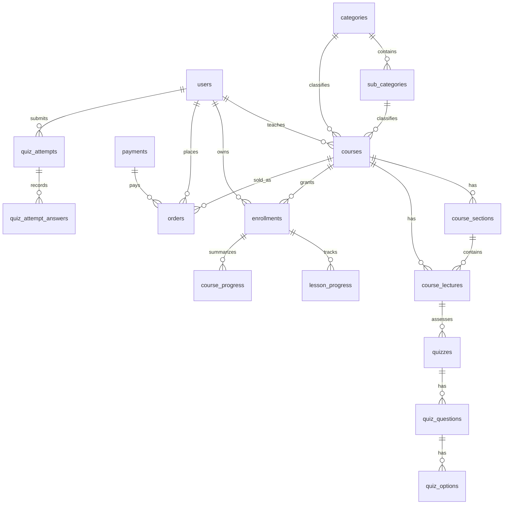

# StackLearn Database

This document summarizes the database model from `database/migrations`.

## Database Engine

`.env.example` uses PostgreSQL:

```env
DB_CONNECTION=pgsql
DB_HOST=127.0.0.1
DB_PORT=5432
DB_DATABASE=stacklearn
```

Laravel queue, session, and cache tables are database-backed by default.

## Core Entity Map



## Identity And Auth

### `users`

Stores students, instructors, and admins.

Important fields:

- `role`: `user`, `instructor`, `admin`
- `status`: active flag stored as enum-like string values `0`/`1`
- `instructor_approval_status`: pending/approved/suspended style workflow state
- profile fields: first name, last name, photo, phone, address, date of birth, city, country, gender

Related platform tables:

- `password_reset_tokens`
- `sessions`
- `cache`, `cache_locks`

## Course Catalog

### `categories`

Stores top-level course categories.

Fields:

- `name`
- `slug`
- `image`

### `sub_categories`

Belongs to `categories`.

Fields:

- `category_id`
- `name`
- `slug`

### `courses`

Main course table.

Important fields:

- `category_id`, `subcategory_id`, `instructor_id`
- media: `course_image`, `video_url`
- naming: course title/name fields and `course_name_slug`
- metadata: `label`, `duration`, `resources`, `certificate`
- pricing: `selling_price`, `discount_price`
- flags: `bestseller`, `featured`, `highestrated`
- content: short/long descriptions and `course_goals`
- approval workflow: `approval_status`, `submitted_for_review_at`, `reviewed_at`, `approved_at`
- learning behavior: `content_unlock_mode` with `free` or `sequential`

### `course_goals`

Structured goals associated with a course. Some goals also appear as JSON on `courses.course_goals`, so check current code before changing the storage format.

### `course_sections`

Course chapters/sections.

Fields:

- `course_id`
- `section_title`

### `course_lectures`

Lectures inside courses and sections.

Important fields:

- `course_id`, `section_id`
- `lecture_title`
- `is_preview`
- `type`, default `video`
- media/document fields: `url`, `file_name`, `mime_type`, `storage_disk`
- `video_duration`

## Ecommerce And Access

### `wishlists`

Connects users to courses they saved.

### `carts`

Connects users to courses in cart with `quantity`.

### `coupons`

Instructor-owned discount codes.

Fields:

- `instructor_id`
- `coupon_code`
- `coupon_discount`
- `discount_validity`
- `status`

### `payments`

Stores payment transaction metadata.

Important fields:

- `transaction_id`
- customer snapshot: `name`, `email`, `phone`, `address`
- `cash_delivery`, `total_amount`, `payment_type`
- provider fields: `provider_payload`, `provider_status`
- refund fields: `refunded_amount`, `refunded_at`, `refund_reference`
- invoice/date/status fields

### `orders`

Stores purchased course line items.

Important fields:

- `payment_id`
- `user_id`, `course_id`, `instructor_id`
- `course_title`, `price`
- `status`: completed/cancelled/pending style values
- `refund_status`: none/pending/approved/rejected style values
- refund/cancel/access timestamps
- revenue split fields: `gross_amount`, `net_amount`, `platform_amount`

### `enrollments`

Grants user access to a course.

Important fields:

- `user_id`, `course_id`, `order_id`
- `source`: `order`, `admin`, `manual`, `coupon`
- `status`: `active`, `completed`, `revoked`, `refunded`
- `access_granted_at`, `access_expires_at`
- `last_lecture_id`, `last_accessed_at`
- `completed_at`, `revoked_at`

Enrollment is the key access-control table for learning.

## Learning Progress

### `lesson_progress`

Per-lecture progress.

Fields:

- `enrollment_id`, `user_id`, `course_id`, `section_id`, `lecture_id`
- `status`: `not_started`, `in_progress`, `completed`
- `started_at`, `last_watched_at`, `completed_at`

### `course_progress`

Course-level progress summary.

Fields:

- `enrollment_id`, `user_id`, `course_id`
- `last_lecture_id`
- progress metrics
- `last_activity_at`, `completed_at`

## Quiz And Assessment

### `quizzes`

Attached to lectures. Used by instructor quiz builder and learner attempts.

### `quiz_questions`

Questions for a quiz.

### `quiz_options`

Answer choices for each question.

### `quiz_attempts`

User attempt record.

### `quiz_attempt_answers`

Selected answers and scoring details for each attempt.

## Reviews, Discussions, Notes, Reports

### `course_reviews`

User reviews on course detail pages.

### `lecture_discussions`

Discussion/Q&A entries tied to lectures. Used by learner UI and instructor moderation.

### `lecture_notes`

Private user notes tied to a lecture.

### `content_reports`

Reports against reviews/discussions with moderation metadata.

Later migration adds:

- `policy_id`
- `action_template_id`

## Governance And Admin

### `instructor_requests`

Tracks user requests to become instructors.

### `admin_audit_logs`

Records admin actions and target metadata.

### `course_quality_checks`

Checklist results for course review.

### `moderation_policies`

Configurable moderation policy records.

### `moderation_action_templates`

Reusable admin action templates.

### `instructor_risk_scores`

Aggregated instructor risk metrics.

Fields include report, refund, rejected course, and warning counts.

## AI Tutor, Documents, Transcript

### `ai_chat_sessions`

Conversation session for a user, course, and lecture.

Fields:

- `user_id`, `course_id`, `lecture_id`
- `title`
- `status`
- `last_activity_at`

### `ai_chat_messages`

Messages in a chat session.

Fields:

- `session_id`, `user_id`
- `role`: user/assistant/system style values
- `provider`, `model`
- token and latency metrics
- `meta_json`

### `ai_documents`

Documents available to retrieval.

Fields:

- `course_id`, optional `lecture_id`
- `uploaded_by`
- `title`
- `source_type`: manual upload/transcript/lesson content style values
- file metadata
- `language`
- `index_status`: pending/processing/indexed/failed style values
- `indexed_at`

### `ai_document_chunks`

Chunked searchable content.

Fields:

- `document_id`, `course_id`, optional `lecture_id`
- chunk body and metadata
- embedding columns added by later migration

### `ai_message_citations`

Links assistant messages to retrieved document chunks.

Fields:

- `message_id`
- `document_id`
- `chunk_id`
- `score`

### `gemini_settings`

Stores Gemini provider configuration.

Fields:

- model name
- API key and base URL
- temperature
- enabled flag

### `concepts`, `lesson_concepts`, `document_concepts`

Ontology/taxonomy layer for associating concepts to lessons and documents.

### `transcript_jobs`

Tracks transcript generation.

Fields:

- `lecture_id`, `course_id`, `requested_by`
- optional `document_id`
- `status`
- request/response JSON payloads
- start/finish timestamps

## Finance

### `refund_requests`

User refund requests and admin decisions.

### `order_status_histories`

Historical status records for orders.

### `payout_requests`

Instructor payout workflow.

Fields:

- `instructor_id`
- `amount`
- bank fields
- `status`: `pending`, `approved`, `rejected`
- `transaction_reference`
- `processed_at`

## Realtime Chat

### `conversations`

Conversation between student and instructor.

Fields:

- `student_id`
- `instructor_id`

### `messages`

Messages inside a conversation.

Fields:

- `conversation_id`
- `sender_id`
- body/content fields
- `is_read`

## Settings And CMS

### `sliders`, `info_boxes`, `partners`, `site_infos`

Public site content and homepage/admin-managed content.

### `striipes`, `googles`, `smtps`

Provider settings stored in DB. The misspelled `striipes` table/model is part of the current project and should not be renamed casually because code depends on it.

## Data Safety Rules

- Do not modify existing migrations that may already have run. Add new migrations.
- Use transactions for orders, payments, refunds, enrollments, payouts, and moderation actions.
- Treat `orders`, `payments`, `enrollments`, `refund_requests`, `payout_requests`, and `admin_audit_logs` as audit-sensitive.
- Do not hard-delete user learning/payment records unless the product requirement explicitly says so.
- Course access should be based on enrollment state, not only a course id from a request.

