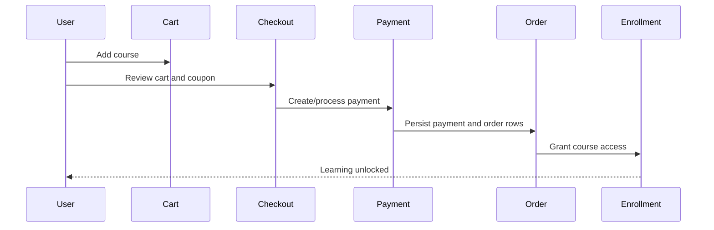

# Commerce, Payments, Refunds, And Payouts

This document covers StackLearn commerce workflows.

## Main Components

Controllers:

- `CheckoutController`
- `OrderController`
- `UserOrderController`
- `BackendOrderController`
- `AdminRefundController`
- `InstructorOrderController`
- `InstructorRevenueController`
- `AdminPayoutController`

Services/repositories:

- `PaymentService`
- `OrderService`
- `EnrollmentService`
- `RefundService`
- `PayoutService`
- `AdminPayoutService`
- `StripeRepository`
- `VnPayRepository`
- `OrderRepository`
- `RefundRepository`
- `PayoutRepository`

Tables:

- `carts`
- `coupons`
- `payments`
- `orders`
- `enrollments`
- `refund_requests`
- `order_status_histories`
- `payout_requests`

## Purchase Flow

Expected behavior:

- Cart items determine the courses being purchased.
- Coupon validation should be server-side.
- Final price must be calculated server-side.
- Payment success creates payment/order data.
- Enrollment is granted only after success.

## Payment Providers

Stripe:

- Dependency: `stripe/stripe-php`
- Settings table/model: `striipes` / `Striipe`
- Repository: `StripeRepository`

VNPay:

- Repository: `VnPayRepository`
- Routes include `/vnpay-payment` and `/vnpay-return`

Payment service:

- `PaymentService::processPayment`

Do not call provider SDKs directly from Blade or scattered controllers. Keep provider details in payment repositories/services.

## Orders

Order records are course line items tied to a payment.

Important fields:

- `payment_id`
- `user_id`
- `course_id`
- `instructor_id`
- `price`
- `status`
- `refund_status`
- `gross_amount`, `net_amount`, `platform_amount`

Admin can view all orders. Instructors view only orders for their courses. Users view their own orders.

## Enrollment Coupling

`enrollments` grants course access.

Purchase and refund code must keep these consistent:

- Successful order -> active enrollment.
- Approved refund/manual cancel -> revoked/refunded enrollment or revoked access.
- Pending/failed/cancelled payment -> no active access.

Relevant service:

- `EnrollmentService`

## Refund Flow

User request:

- `POST user/orders/{order}/refund-request`

Admin actions:

- View refund requests.
- Approve request.
- Reject request.
- Manual refund.
- Manual cancel.

Core service:

- `RefundService`

Rules:

- Use `DB::transaction`.
- Validate order ownership for user requests.
- Validate refund amount and current refund status.
- Update `orders.refund_status`, refund timestamps, `payments.refunded_amount`, and enrollment access consistently.
- Write status history/audit where current code supports it.

## Payout Flow

Instructor:

- Views revenue dashboard.
- Requests payout with bank info and amount.

Admin:

- Lists payout requests.
- Approves or rejects payout.
- Records transaction reference and processed timestamp.

Core services:

- `PayoutService`
- `AdminPayoutService`
- `InstructorSalesService`

Rules:

- Payout amount cannot exceed available instructor balance.
- Available balance should exclude refunded/cancelled orders and already processed/pending payouts.
- Admin decision should be transactional.

## Coupons

Instructor coupons are stored in `coupons`.

Fields:

- `instructor_id`
- `coupon_code`
- `coupon_discount`
- `discount_validity`
- `status`

Coupon checks should validate:

- Code exists and is active.
- Date/validity is still acceptable.
- Coupon applies to the course/instructor in cart.
- Discount is calculated server-side.

## Verification Checklist

- Add cart item and apply valid/invalid coupon.
- Checkout with Stripe path.
- Checkout with VNPay return path.
- Verify payment/order/enrollment rows after success.
- Verify no enrollment is created after failed/cancelled payment.
- Request refund as user.
- Approve/reject refund as admin and verify access changes.
- Request payout as instructor and process as admin.

